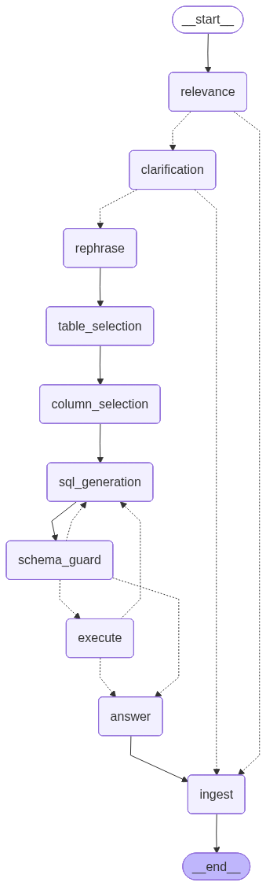

# nlp2sql

A natural-language-to-SQL **agent** built on [LangGraph](https://langchain-ai.github.io/langgraph/),
querying a movie database (the [Sakila](https://dev.mysql.com/doc/sakila/en/) sample schema, SQLite).
This is the **framework phase** — a reusable graph + CLI. A FastAPI service will
wrap the same `build_graph()` later without changes to the agent.

## Pipeline



> Regenerate the image after topology changes: `python scripts/render_graph.py`
> (writes `assets/graph.png` + `assets/graph.mmd`).

```
relevance (1) ─not relevant─────────────────► refuse ─┐
   │ relevant                                          │
clarification (1b) ─needs info─► ask user ─────────────┤
   │ ok                                                │
rephrase (2) ─► table_select (3) ─► column_select (4)  │
                                         │             │
            ┌───────────────► sql_generation (5) ◄──┐  │
            │                        │              │  │
   retry ≤ MAX_RETRIES        schema_guard (6) ─────┘  │  (unsafe → regenerate)
            │                        │ safe         │  │
            └──────────────────► execute (7) ───────┘  │  (db error → regenerate)
                                     │ ok / exhausted   │
                                  answer (8) ───────────┤
                                                        ▼
                                                  ingest ─► END
```

- **Nodes 6 (guard) and 7 (execute) share one retry counter** (`MAX_RETRIES`, default 2).
- **Every** terminal path (answered / refused / clarification / failed) routes
  through `ingest`, so the conversation store records a complete history.

## Safety — defense in depth

1. **Read-only connection** — SQLite opened as `file:...?mode=ro`; writes can't
   execute even if they slip through. (`db/connection.py`)
2. **Static parse guard** — `sqlparse` confirms a single read-only `SELECT`
   before any LLM call. (`sql_safety.py`)
3. **LLM guard (Node 6)** — catches subtler intent and produces feedback that is
   fed back to the generator on retry. (`nodes/schema_guard.py`)

## Persistence & caching

| Layer | Purpose | Now | Later |
|---|---|---|---|
| Cache | Table schemas + descriptions (static) | in-memory (`cache/memory.py`) | Redis (same `Cache` protocol) |
| Checkpointer | Resume interrupted threads (memory) | `SqliteSaver` | Postgres |
| Conversation store | Audit/analytics, one row per turn | SQLite (`persistence/`) | Postgres |

The cache is **warmed at startup** (`db/introspect.warm_cache`), so the
introspection nodes never touch SQLite at runtime.

## Observability (LangSmith)

Tracing is opt-in. Set these in `.env` and every node run, LLM call, and retry
loop shows up as a trace in [LangSmith](https://smith.langchain.com):

```bash
LANGSMITH_TRACING=true
LANGSMITH_API_KEY=lsv2_...
LANGSMITH_PROJECT=nlp2sql
```

`build_graph()` calls `setup_tracing()` ([observability.py](src/nlp2sql/observability.py)),
which loads these from settings into the environment LangChain reads — no manual
`export` needed. It's a no-op when `LANGSMITH_TRACING=false`.

## Prompts

All LLM prompts are **Jinja2 templates** in [`src/nlp2sql/prompts/`](src/nlp2sql/prompts) —
`<node>.system.j2` / `<node>.user.j2`, plus shared `fragments/`. Because they're
Jinja2, both wording *and* presentation logic live in the files: conditionals
(retry feedback) and loops (catalog/column lists) are in the templates, so nodes
just pass raw data. Edit a template and it **hot-reloads** (no restart). `{{ domain }}`
is auto-injected from `fragments/domain.j2`; `StrictUndefined` flags missing
variables. Point `PROMPTS_DIR` at another folder to override the packaged prompts.
Structural output schemas stay in `llm/schemas.py`.

## Semantic metadata (column descriptions)

The agent's schema context is enriched with **table/column descriptions** so it
understands what columns *mean*, not just their names. Descriptions come through
a pluggable `SemanticMetadataProvider` ([metadata/](src/nlp2sql/metadata)), merged
by priority — so warehouse-native sources slot in later without code changes:

```
catalog / dbt  →  native engine comments  →  file sidecar  →  name heuristics
(Unity, Snowflake,   (Snowflake/Databricks/    (metadata/        (fallback)
 Atlan, ...)          BigQuery COMMENT,         sakila.yaml)
                      SQL Server ext. props)
```

SQLite has no native column comments, so the seed DB uses a YAML **sidecar**
([metadata/sakila.yaml](src/nlp2sql/metadata/sakila.yaml)) — edit it to tune
descriptions, no code change. Point `METADATA_PATH` at another `.yaml`/`.json`
for a different database.

## Setup

```bash
python -m venv .venv && source .venv/bin/activate
pip install -e ".[dev]"

python data/setup_db.py            # download Sakila -> data/sakila.db

cp .env.example .env               # then set OPENAI_API_KEY
```

## Run

```bash
nlp2sql                  # new conversation
nlp2sql --thread demo    # named thread (memory persists across runs)
```

Example questions:
- "How many films are in the Comedy category?"
- "Which 5 actors appear in the most films?"
- "What's the total revenue from rentals in 2005?" — then "...and just for store 1?" (uses memory)
- "What's the weather today?" — refused (out of scope)

## Test

```bash
pytest            # 13 tests: safety, db/read-only, caching, routing, store
```

## Layout

```
src/nlp2sql/
├── config.py            # settings (model, db paths, retries, cache, langsmith)
├── observability.py     # LangSmith tracing setup
├── state.py             # AgentState (TypedDict threaded through nodes)
├── cache/               # Cache protocol + in-memory backend (Redis later)
├── db/                  # read-only connection + cached introspection
├── persistence/         # ConversationStore (turn-level audit log)
├── prompts/             # Jinja2 prompt templates (.j2) — edit without touching code
├── metadata/            # SemanticMetadataProvider + sakila.yaml (column descriptions)
├── llm/                 # chat model (init_chat_model) + prompt loader + schemas
├── nodes/               # one module per pipeline node
├── sql_safety.py        # deterministic static SELECT guard
├── graph.py             # build_graph(): wiring, retry loops, checkpointer
└── cli.py               # interactive REPL (run_turn is reused by the API later)
```
